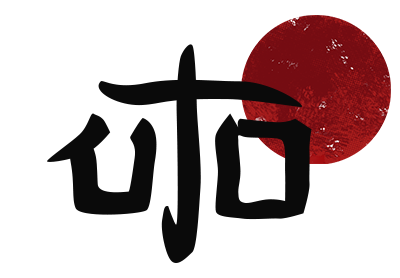

# YouAreUto

> _Let your name be traveler, first rains of spring._

**YouAreUto** is an open source mobile game that pushes you to think outside the box and use your lateral thinking. 

The game is developed with [Godot Engine v3.2.1](https://godotengine.org/download/).

## Principles

- Free as in freedom 
- No ads
- Foster creativity
- Bring enjoyment
- Maintain high quality standards

## Download

- PlayStore: https://play.google.com/store/apps/details?id=com.youare.uto
- Itch.io: https://uto-games.itch.io/youareuto
- FDroid: wip

Currently YouAreUto is available only on Android.

## Contribute and create your challenge

If you want to contribute or create your unique challenge, that's amazing!

Before diving into the contributing guidelines, feel free to [join us on Discord](https://discord.gg/3zxN6kQ).  
Here you can get in touch to discuss anything about YouAreUto.

### Create your challenge

> :warning: This guide is a reference, we are currently working on a refactoring
to create a generic `Challenge.tscn` scene. See issue #1 https://github.com/YouAreUto/YouAreUto/issues/1

To create your challenge, follow these steps:

- Fork the repository
- Clone the project on your computer
- Open the project with [Godot 3.2.1](https://godotengine.org/download)
- Create a new inherited scene in `scenes/challenges/users/<your-username>/<your-challenge-title>`
- Extends the `Challenge.tscn` scene for a base template
- Create your unique challenge! 
Remember to:
  - dispatch the `victory` signal
  - dispatch the `game_over` signal
- Create a Pull Request to submit your challenge

The challenge needs to follow 2 simple guidelines:

1. Rules need to be displayed during the game
2. At least one rule needs to be changed by the player in order to win

### Submit your idea

If you have an idea for a challenge:

TODO

### How challenges are evaluated

TODO

### Support us

## Original developers

- Mauro Pellegrini - Ideator
- Daniela Arienti - Designer
- Davide Cristini - Programmer

Additional help for the open source release:

- Giovanni Bodega
